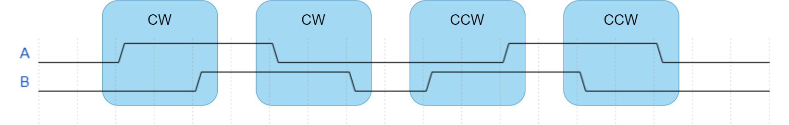
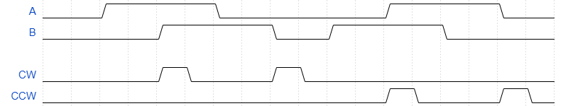
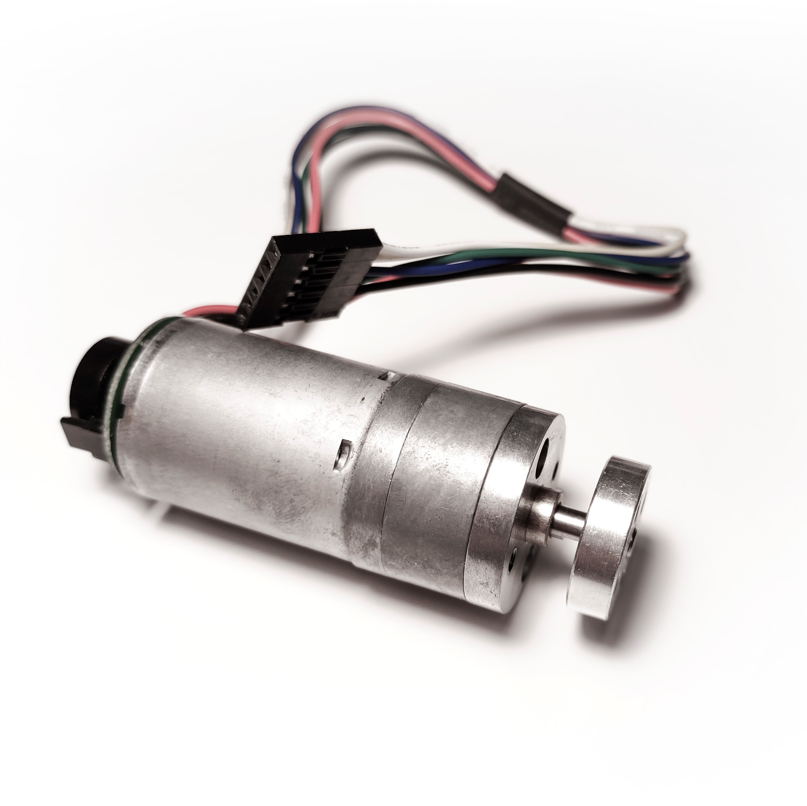
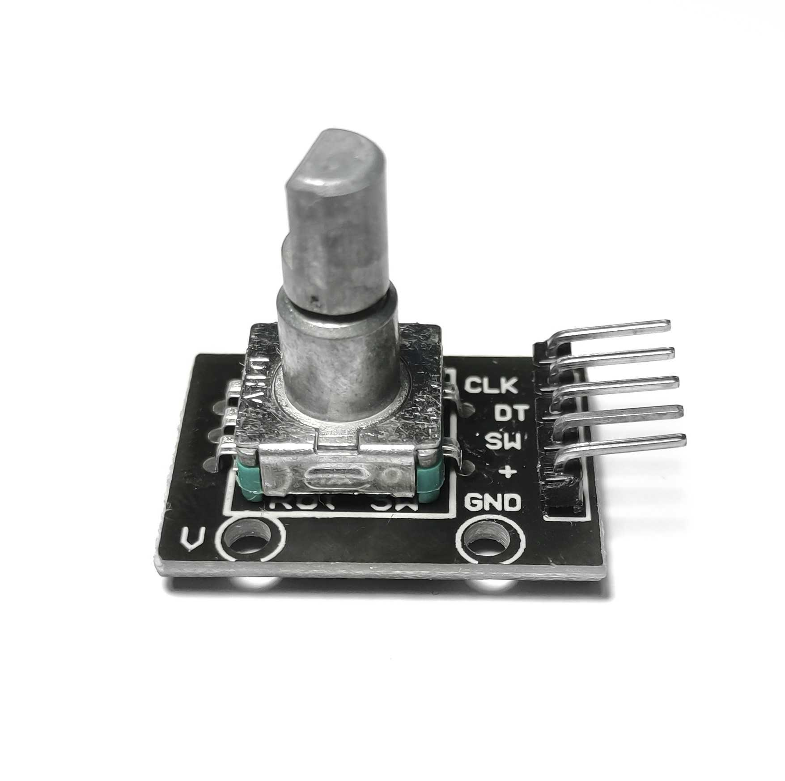
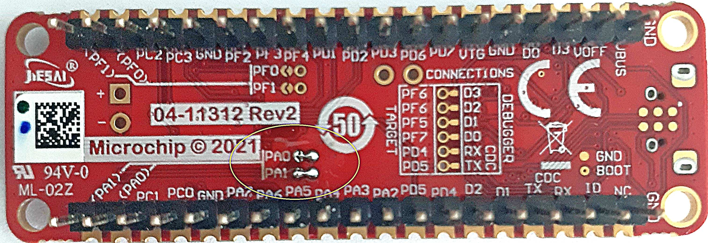
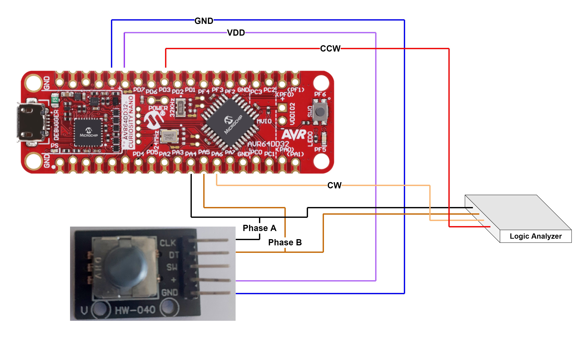
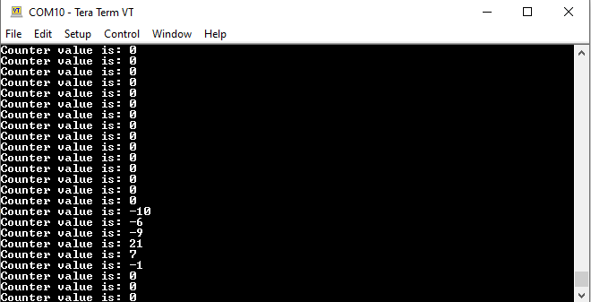

 # Core Independent Quadrature Decoder using the AVR64DD32 Microcontroller with MCC Melody

 

Quadrature signals are the standard waveforms used as output for incremental encoders that come with motors. They provide information about motor direction and shaft position. There are two types of encoders - linear and rotary - and each can have two types of measurement: Absolute and incremental. There are also different technologies used for encoders: Magnetic, optical, inductive, capacitive, and laser. 

The main categories of encoders are absolute and incremental. A rotary absolute encoder outputs a unique code for each position of the motor's shaft. If the power of this encoder is lost and the shaft is rotated, the encoder can return the correct position of the shaft. The rotary incremental encoder generates pulses while the shaft is rotated. If any pulse is missed, then the shaft position cannot be determined correctly anymore.
This application will use a rotary incremental encoder to show how to decode quadrature signals.

The following image highlights the Clockwise (CW) and Counterclockwise (CCW) conditions on the quadrature signals A and B. When signal A leads signal B (on rising or falling edge), it will be a clockwise detection, otherwise, when signal B leads signal A (on rising or falling edge), it will be a counterclockwise detection.

 

The quadrature decoder uses the Configurable Custom Logic (CCL) to detect CW and CCW pulses. The following picture shows the output signals of the CCL implementation, CW and CCW, based on the quadrature signals A and B.

 

Using the Event System (EVSYS) peripheral, the CW and CCW signals are linked to two TCB instances: One counts the CW pulses, the other one counts the CCW pulses.

 

##  Related Documentation

More details and code examples on the AVR64DD32 can be found at the following links:
- [Interfacing Quadrature Encoder using CCL with TCA and TCB](http://ww1.microchip.com/downloads/en/AppNotes/00002434A.pdf)
- [Getting Started with CCL](http://ww1.microchip.com/downloads/en/AppNotes/TB3218-Getting-Started-with-CCL-90003218A.pdf)
- [AVR64DD32 Product Page](https://www.microchip.com/wwwproducts/en/AVR64DD32)
- [AVR64DD32 Code Examples on GitHub](https://github.com/microchip-pic-avr-examples?q=AVR64DD32)
- [AVR64DD32 Project Examples in START](https://start.atmel.com/#examples/AVR64DD32CuriosityNano)

##  Software Used

- [MPLAB® X IDE 6.00 or newer](http://www.microchip.com/mplab/mplab-x-ide)
- [MPLAB® XC8 2.36 or a newer compiler](http://www.microchip.com/mplab/compilers)
- [AVR-Dx Series Device Pack v2.1.152 or newer](https://packs.download.microchip.com)
- [MPLAB® Code Configurator Melody core 2.1.13 or newer](https://www.microchip.com/en-us/tools-resources/configure/mplab-code-configurator/melody)
- [MPLAB® Code Configurator Melody Drivers](https://www.microchip.com/en-us/tools-resources/configure/mplab-code-configurator/melody)
 
TCB: 5.0.5
 
UART: 1.6.0
 
CCL: 3.1.2

- Saleae Logic
- Terminal software – Tera term, Real term, PuTTY, etc vXXX

##  Hardware Used

- The AVR64DD32 Curiosity Nano Development Board is used as a test platform.
    
- Oscilloscope/Logic Analyzer
- Motor with encoder

     
- Rotary encoder  
     

## Operation

To program the Curiosity Nano board with this MPLAB® X project, follow the steps provided in the [How to Program the Curiosity Nano Board](#how-to-program-the-curiosity-nano-board) chapter.  

## 1. Setup

The AVR64DD32 Curiosity Nano Development Board is used as test platform.

 

**PA0** and **PA1** are not connected by default on the AVR64DD32 board. **The user must connect them through soldering on the back of the board where it is written PA0 and PA1**.

 

The following configurations must be made for this project:

|  Pin  |    Configuration    |    Semnification    |
| :---: | :-----------------: | :-----------------: |
|  PA0  | Input               | Phase A             |
|  PA1  | Input               | Phase B             |
|  PC0  | Output              | USART TX            |
|  PC1  | Input               | USART RX            |
|  PA6  | Output              | CW detection        |
|  PD3  | Output              | CCW detection       |

 
  

 ## 2. Demo

In this demo, the function `QEI_GetVelocity` is called every second and the return is printed on serial communication. 

 
  

 ## 3. Summary

The quadrature decoder can detect and count clockwise and counterclockwise pulses on rising and falling edges of the quadrature signals.

- [Back to Top](#core-independent-quadrature-decoder-using-the-avr64dd32-microcontroller-with-mcc-melody)  

##  How to Program the Curiosity Nano board

This chapter shows how to use the MPLAB® X IDE to program an AVR® device with an Example_Project.X. This can be applied for any other projects.

- Connect the board to the PC.

- Open the Example_Project.X project in MPLAB X IDE.

- Set the Example_Project.X project as main project.

  - Right click on the project in the **Projects** tab and click **Set as Main Project**.
     

- Clean and build the Example_Project.X project.

  - Right click on the **Example_Project.X** project and select **Clean and Build**.
     

- Select the **AVRxxxxx Curiosity Nano** in the Connected Hardware Tool section of the project settings:

  - Right click on the project and click **Properties**
  - Click on the arrow under the Connected Hardware Tool
  - Select the **AVRxxxxx Curiosity Nano** (click on the **SN**), click **Apply** and then click **OK**:
     

- Program the project to the board.
  - Right click on the project and click **Make and Program Device**.
     

 

- [Back to  Setup](#1-setup)
- [Back to  Demo](#2-demo)
- [Back to  Summary](#3-summary) 
- [Back to Top](#core-independent-quadrature-decoder-using-the-avr64dd32-microcontroller-with-mcc-melody)

